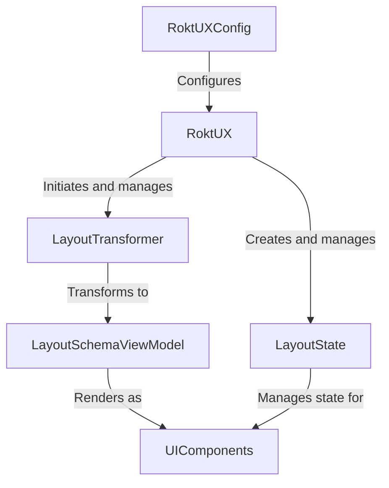

# Rokt UX Helper iOS

The RoktUXHelper enables partner applications to render tailored user experiences, improving the velocity of testing and relevancy for the customer. This library offers an easy way to perform rendering and provides event hooks for integration into backend systems.

## Resident Experts

- Thomson Thomas - <thomson.thomas@rokt.com>
- Danial Motahari - <danial.motahari@rokt.com>
- Miran Nakamura - <miran.nakamura@rokt.com>
- Wei Yew - <wei.yew.teoh@rokt.com>

| Environment | Build                                                                                               | Coverage                                                                                                                                    |
| ----------- | --------------------------------------------------------------------------------------------------- | ------------------------------------------------------------------------------------------------------------------------------------------- |
| main        |  | [](https://codecov.io/gh/ROKT/rokt-ux-helper-ios) |

## Requirements

- Download the latest [Xcode](https://developer.apple.com/xcode/). Project is configured to run on iOS 15.0 and above and compiled with the latest version of iOS.
- clone the repository using `git clone git@github.com:ROKT/rokt-ux-helper-ios.git`

## Installation

### Swift Package Manager

#### Xcode

To integrate to your Xcode project, select File > Add Package Dependency and enter
`https://github.com/ROKT/rokt-ux-helper-ios`.
You can also navigate to your target's General pane, and in the "Frameworks, Libraries, and Embedded Content" section, click the + button, select Add Other, and choose Add Package Dependency.

#### Swift package

To integrate to your Swift package, add the following SPM dependency into your `Package.swift` file. This configuration ensures that your app will receive updates to the library up to, but not including, the next major release.

```swift
dependencies: [
    .package(url: "https://github.com/ROKT/rokt-ux-helper-ios.git", .upToNextMajor(from: "0.1.0"))
]
```

## Architecture



The RoktUX Helper iOS follows a unidirectional data flow architecture with these key components:

- **RoktUX**: The main entry point that orchestrates the rendering process and manages the overall state
- **LayoutTransformer**: Converts layout schema from backend responses into view models
- **LayoutSchemaViewModel**: Represents the UI structure in a framework-agnostic way
- **LayoutState**: Maintains the state of UI components and handles user interactions
- **UIComponents**: The actual UI components rendered on screen (compatible with both SwiftUI and UIKit)

Data flows from the backend response through the transformer to create view models, which are then rendered as UI components. User interactions flow back through the state management system to trigger callbacks and state updates.

## How to run unit tests locally?

Open the `Package.swift` file with Xcode and press `command + U`, or `Product -> Test` from the menu bar.

## How to run tests on Buildkite?

Just push a change to any of the feature branches and tests will be run on [Buildkite](https://buildkite.com/rokt/ux-helper-ios-build).

## Key Dependencies & Gotchas

### SDK Dependencies

- **DcuiSchema**: Core library for parsing experience response. Any schema changes require careful testing to ensure compatibility.
- **ViewInspector**: Used only for testing - not included in production builds.

### Integration Gotchas

1. **iOS Version Compatibility**: The library requires iOS 15.0+. Using with earlier iOS versions will not render any layouts.

2. **Error Handling**:
   - Schema parsing errors are handled gracefully but may result in empty views

## Example App

An example app is available in this repository to demonstrate integration with RoktUXHelper using both SwiftUI and UIKit. For detailed implementation examples, refer to the [example app README](https://github.com/ROKT/rokt-ux-helper-ios/tree/main/Example).

## FAQ

### 1. Documentation

For detailed documentation, check the [SwiftUI integration guide](https://docs.rokt.com/server-to-server/ios?platform=swiftui) and [UIKit integration guide](https://docs.rokt.com/server-to-server/ios?platform=uikit).

### 2. What are the branches?

There are main branches coresponding to each version : **Main**, **Release branches** and **Features branches**

- **main** - This is the main, default branch. Feature branches merge back into this branch, and release branches are created off this branch.
- **release branches** - This branch is production ready.
- **feature branches** - After every push to this branch swift lint and tests are run to ensure no breaking changes are allowed.

### 3. Where are the Buildkite configurations?

They are in `.buildkite/pipeline.yml`

## Creating a Release

To create a new release version:

1. Navigate to the "Actions" tab in the GitHub repository
2. Select the "Create draft release" workflow
3. Click "Run workflow" and use the dropdown to select the `main` branch
4. Enter the version number in X.Y.Z format (e.g., 1.2.0)
5. If needed, add a suffix (e.g., -alpha.1)
6. Click "Run workflow" to start the process

This workflow will:

- Create a release PR with the specified version allowing you to review
- Generate release notes based on CHANGELOG.md
